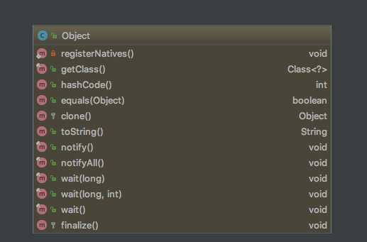

Object 源码学习
====

## 简介

Object 是所有类层次结构的根类，也就是所有类的"祖先类"。

## 继承体系

  
 

## 源码解析

## 属性

无

## 构造方法

默认

## 普通方法

都是一些常用的方法，因此就不过多展开。

值得注意的几点:

* 如果子类重写了 equals 方法也要重写 hashCode 方法。

* 尽量不要使用 finalize() 方法，因为不能保证会执行，出现不可预知的情况。