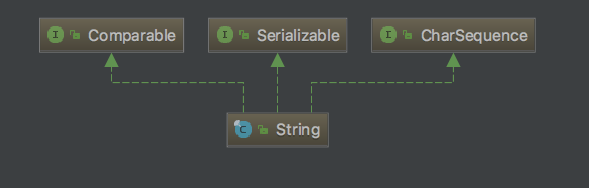

String 源码解析
====

## 简介

String 是 Java 语言非常基础和重要的类，提供了构造和管理字符串的各种基本逻辑。它是典型的Immutable类，所以是线程安全的。【基于 jdk 1.8.0_151】

## 继承体系

<div align="center">  </div><br>

* String 实现了 Comparable 接口，提供了比较的方法 compareTo
* String 实现了 CharSequence 接口，提供了一些操作字符序列的方法
* String 实现了 Serializable，可以被序列化

## 源码解析

## 属性

```java
	/** The value is used for character storage. */
    private final char value[];

    /** Cache the hash code for the string */
    private int hash; // Default to 0
```

* 不可变(final)的 char 数组用于存放字符串

* hash 变量保存计算后的哈希值

## 构造方法

String 的构造方法很多，下面主要介绍几种典型的代表，其他可以参考理解。

```java
// 参数为 String 类型
public String(String original) {
        this.value = original.value;
        this.hash = original.hash;
    }

// 参数为 char 数组，使用 java.util 包中的 Arrays 类复制(底层真正使用 System.arraycopy，intrnisic 优化过)
public String(char value[]) {
        this.value = Arrays.copyOf(value, value.length);
    }

//从bytes数组中的offset位置开始，将长度为length的字节，以charsetName格式编码，拷贝到value
public String(byte bytes[], int offset, int length, String charsetName)
        throws UnsupportedEncodingException {
    if (charsetName == null)
        throw new NullPointerException("charsetName");
    checkBounds(bytes, offset, length);
    this.value = StringCoding.decode(charsetName, bytes, offset, length);
}

// . . . 其他类似参见源码
```

## 普通方法

### equals(Object anObject) 方法

```java
public boolean equals(Object anObject) {
		 // 如果引用的是同一个对象，返回 true
        if (this == anObject) {
            return true;
        }
        // 如果不是 String 类型，返回 false
        if (anObject instanceof String) {
            String anotherString = (String)anObject;
            int n = value.length;
            // 如果长度不相等，返回 false
            if (n == anotherString.value.length) {
                char v1[] = value;
                char v2[] = anotherString.value;
                int i = 0;
                while (n-- != 0) {
                    if (v1[i] != v2[i])
                        return false;
                    i++;
                }
                return true;
            }
        }
        return false;
    }
```

从上面的代码可以看出，比较相等的流程为:

* 如果内存地址(引用)相同，为 true
* 如果不是 String 类型，返回 false
	* 如果对象长度不相等，返回 false
		* 如果从前往后任一一个字符串不相等，返回 false;否则，返回 true

> 从上面的代码实现可见，对于两个非常长的字符串进行比较还是非常耗时的，可以考虑用其他方式(如哈希值)

### hashCode() 方法

```java
public int hashCode() {
        int h = hash;
        // hash 值没有被计算过，且字符串不为空
        if (h == 0 && value.length > 0) {
            char val[] = value;

            for (int i = 0; i < value.length; i++) {
                h = 31 * h + val[i];
            }
            hash = h;
        }
        return h;
    }
```

计算哈希值有一个小细节: 乘数是 31，这是因为这个数经过验证，可以很大程序上减少“哈希碰撞”。

由于“哈希碰撞”的存在，我们可以通过不相同的字符串得出同样的 hash 值，所以两个 String 对象的 hashCode 相同，并不代表两个String 一定是相同的。

### compareTo(String anotherString) 方法

```java
public int compareTo(String anotherString) {
		  // 自身字符串长度 len1
        int len1 = value.length;
        // 被比较字符串长度 len2
        int len2 = anotherString.value.length;
        // 取两者最小值
        int lim = Math.min(len1, len2);
        char v1[] = value;
        char v2[] = anotherString.value;

        int k = 0;
        // 从第一个字符串开始比较直到 lim，如果不想等，返回字符比较结果；
        // 如果长度相等且字符也相等，返回长度差(更长的更大)
        while (k < lim) {
            char c1 = v1[k];
            char c2 = v2[k];
            if (c1 != c2) {
                return c1 - c2;
            }
            k++;
        }
        return len1 - len2;
    }
```

这个方法的巧妙之处在于: 先从第一个字符开始判断字符大小。如果两个对象能比较字符的地方在比较完成后依然相等，就直接返回自身长度减被比较对象长度，如果两个字符串长度相等，则返回的是0，巧妙地判断了三种情况。

### startsWith(String prefix, int toffset) 方法

```java
public boolean startsWith(String prefix, int toffset) {
        char ta[] = value;
        int to = toffset;
        char pa[] = prefix.value;
        int po = 0;
        int pc = prefix.value.length;
        // Note: toffset might be near -1>>>1.
        // 如果起始地址小于 0 或者(起始地址 + 所比较对象的长度)大于自身的长度
        if ((toffset < 0) || (toffset > value.length - pc)) {
            return false;
        }
        while (--pc >= 0) {
        	  // 从头开始比较
            if (ta[to++] != pa[po++]) {
                return false;
            }
        }
        return true;
    }
    
public boolean startsWith(String prefix) {
        return startsWith(prefix, 0);
    }
    
 public boolean endsWith(String suffix) {
        return startsWith(suffix, value.length - suffix.value.length);
    }
```

### replace(char oldChar, char newChar) 方法

```java
public String replace(char oldChar, char newChar) {
		  // 新旧值对比
        if (oldChar != newChar) {
            int len = value.length;
            int i = -1;
            char[] val = value; /* avoid getfield opcode */

			  // 找到旧值最开始出现的位置，节约比对的成本
            while (++i < len) {
                if (val[i] == oldChar) {
                    break;
                }
            }
            // 从上述位置开始，直到末尾，用新值替换旧值
            if (i < len) {
                char buf[] = new char[len];
                for (int j = 0; j < i; j++) {
                    buf[j] = val[j];
                }
                while (i < len) {
                    char c = val[i];
                    buf[i] = (c == oldChar) ? newChar : c;
                    i++;
                }
                return new String(buf, true);
            }
        }
        return this;
    }
```

这个方法的小细节在于:先找出旧值最先出现的位置，节约一部分比对时间。

这里提醒下，replace(CharSequence target, CharSequence replacement) 方法是通过正则表达式

## trim() 方法

```java
public String trim() {
        int len = value.length;
        int st = 0;
        char[] val = value;    /* avoid getfield opcode */

        while ((st < len) && (val[st] <= ' ')) {
            st++;
        }
        while ((st < len) && (val[len - 1] <= ' ')) {
            len--;
        }
        return ((st > 0) || (len < value.length)) ? substring(st, len) : this;
    }
```

初学者一个容易误解的地方是: trim() 只能去除字符串最前和最后的空格，不能去除字符串中间的空格，如 `  test `处理后变为 `test`，不能将 `te  st` 处理为 `test`

### intern() 方法

```java
public native String intern();
```

intern 方法是 Native 调用，它的作用: 在方法区中的常量池中通过 equals 方法查找字面值的对象，若没有找到则在常量池中开辟一片空间存放字符串并返回该 String 的引用，否则直接返回常量池中已存在 String 对象的引用。

Intern是一种显式地排重机制，但是它也有一定的副作用。

> 因为需要开发者写代码时明确调用，一是不方便，每一个都显式调用是非常麻烦的;另外就是我们很难保证效率，应用开发阶段很难清楚地预计字符串的重复情况，有人认为这是一种污染代码的实践。

在Oracle JDK 8u20之后，推出了一个新的特性，也就是G1 GC下的字符串排重。它是通过将相同数据的字符串指向同一份数据来做到的，是JVM 底层的改变，并不需要Java类库做什么修改。

> 注意这个功能目前是默认关闭的，你需要使用下面参数开启，并且记得指定使用G1 GC:
> 
> 		-XX:+UseStringDeduplication

## 小结

String 是典型的 Immutable 类，被声明成为 final class，所有属性也都是 final 的。也由于它的不可变性，类似拼接、裁剪字符串等动作，都会产生新的String对象。由于字符串操作的普遍性，所以相关操作的效率往往对应用性能有明显影响。